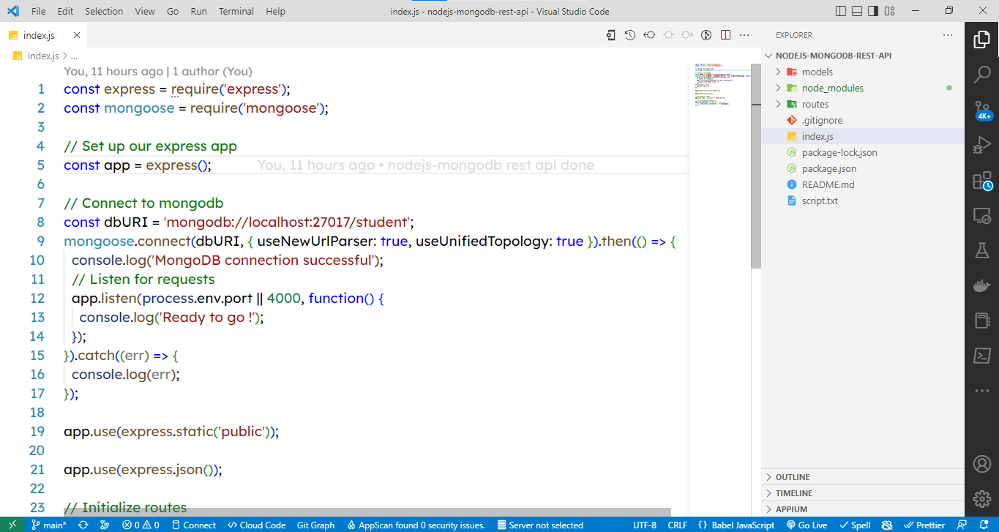
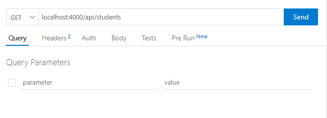
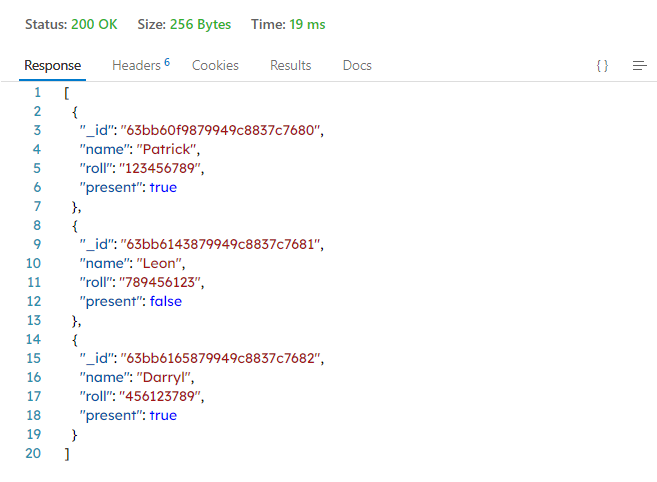
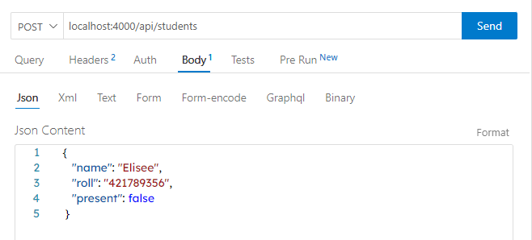
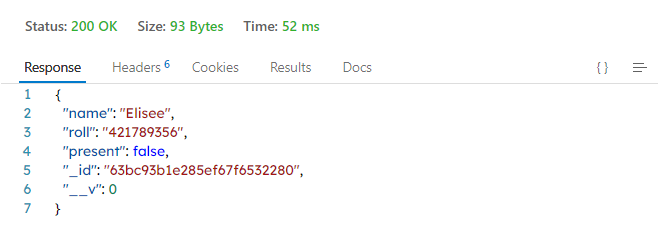

# nodejs-mongodb-rest-api
A REST api built using NodeJS and MongoDB

## Summary
1. About
2. Presentation & Examples

## 1. About
### 1.1 Installation
This api uses NodeJS version 16.14.2, MongoDB version 6.0.3 and some other dependencies the versions of which are :
```dependencies
dotenv : "^16.0.3",
express : "^4.18.2",
mongoose : "^6.8.3",
nodemon :  "^2.0.20"
```
#### 1.1.1 Install the project dependencies
First, open the project on Visual Studio Code. Once it did, then go to terminal and type :
```dependencies
npm install
```

#### 1.1.2 Download and install MongoDB
Since the project uses MongoDB as the database, we need to download and install it locally. Here is the link below :

[mongodb-windows-x86_64-6.0.3-signed.msi](https://www.mongodb.com/download-center/community/releases)

Note : Leave checked the option "Install MongoDBCompass" and after the installation precise the MongoDB bin folder in your PATH environment variable. 
To ensure MongoDB was successfully installed, go to your command prompt and type these commands :
```mongodb
mongod --version
mongo
``` 
If the mongo command does not work, it means you need to install MongoDB Shell. Here is the link :

[download MongoDB Shell](https://winget.run/pkg/MongoDB/Shell)

Note : Just paste the command given on the site in your Windows command prompt or cmd

#### 1.1.3 Create the database, the collection and insert some datasets
After installing the project dependencies and MongoDB, we now need to create the database and the collection that will be using. To do so, follow these commands :
```mongodb
// Open MongoDBCompass, go to >_MONGOSH and get the existing databases
show dbs
// Implicitly create the student database
use student
// Verify that the student's database was really created and that you are on
db
```

#### 1.1.4 Launch the server
To launch the server, just go back to your Visual Studio Code then on terminal and type the following command :
```nodejs
npm start
```
### 1.2 Contribution
In order to enhance to this project, just make a contribution by doing a pull request. It'll be a great pleasure to receive it.
### 1.3 Author
[NOUMEN Darryl](https://www.linkedin.com/in/darryl-noumen-941213255/)

## 2 Presentation & Examples
### 2.1 Structure
After following the instructions above, the project structure may look like this :



### 2.2 Examples
### 2.2.1 Example 1
> Get all the students in the student's database



##### 2.2.1.1. Results



#### 2.2.2.2 Example 2
> Add a student in the student's database



##### 2.2.2.1. Results

